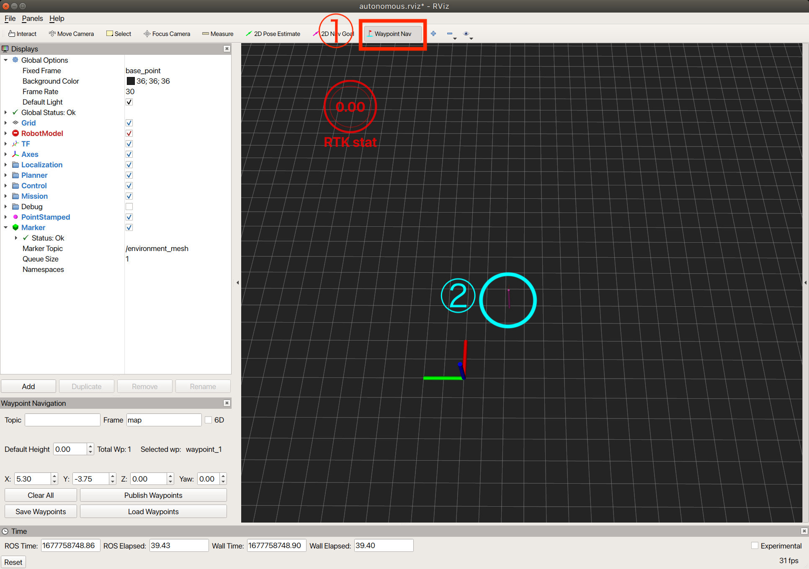
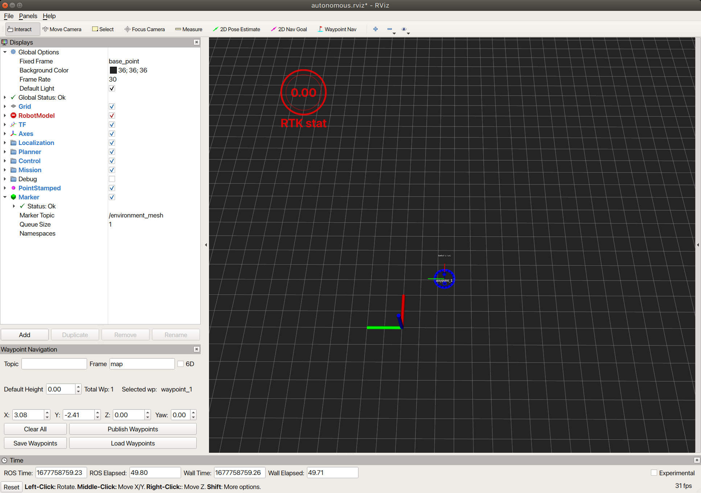
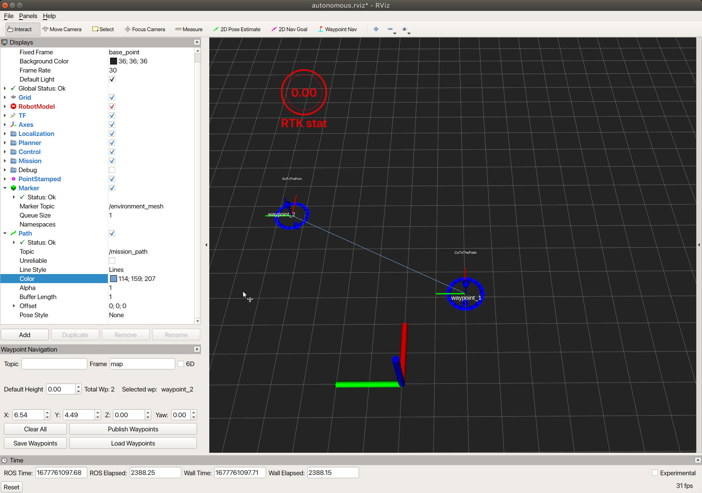

# ウェイポイント（目標位置）基本操作

1. ウェイポイントを配置するためには、まずRviz のツールバー上の「Waypoint Nav」ボタンを押します。
2. 「Waypoint Nav」ボタンを押したのちマウスをグリッド上に動かすと、ピンが見えるようになります。ピンが見えている状態で左クリックするとウェイポイントが画面上に配置されます。 

ウェイポイントが配置された様子　

同様の操作で複数のウェイポイントを配置することができます。

