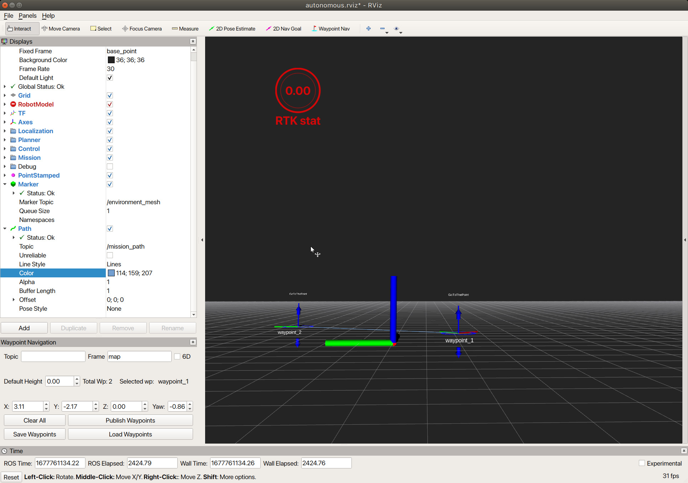
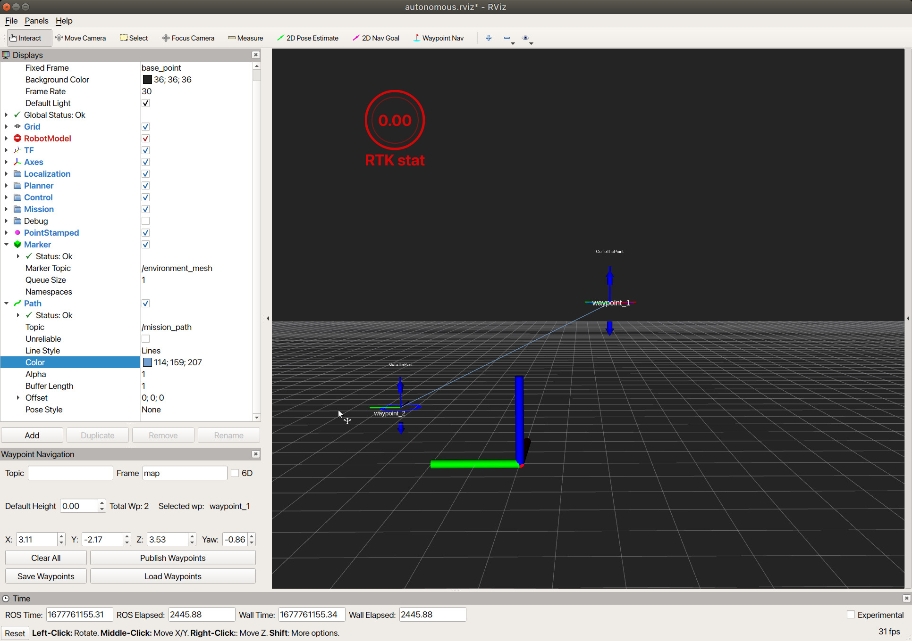
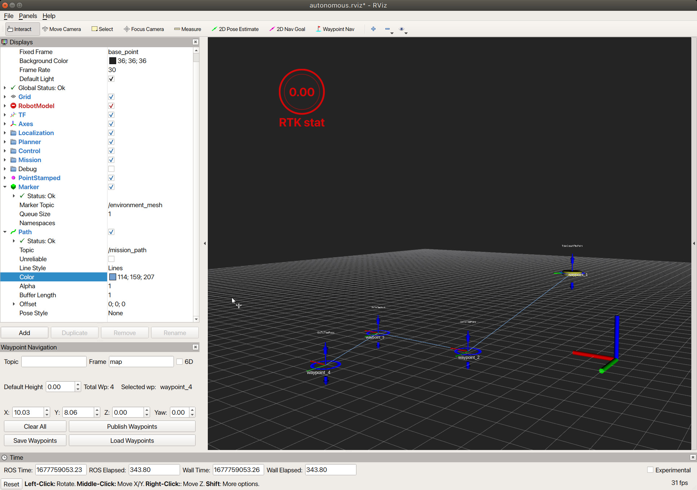

# ウェイポイント高さ操作

Rviz のツールバー上の「Interact」ボタンを押したのち、画面操作を行うことでカメラ視点の切り替えを行うことができます。

ウェイポイントが持つ上下に伸びた青い矢印をクリックしながらマウスを動かすことで、ウェイポイントの高さを変更することができます。

このような機能を使うことで、高さや向きが異なる複数のウェイポイントを作成することが可能となります。

