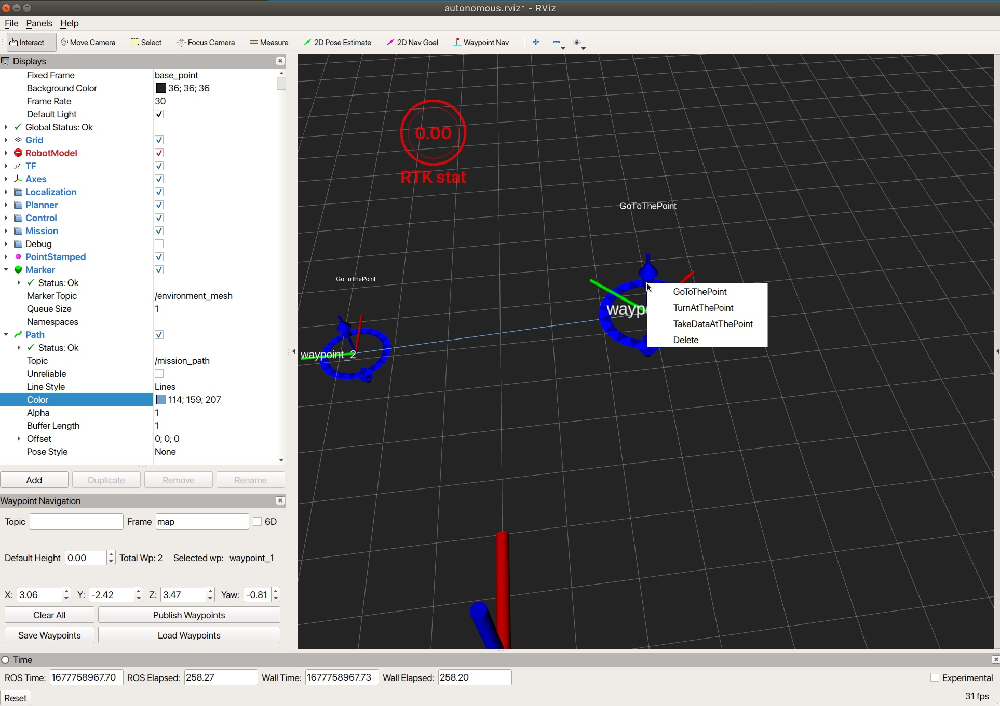
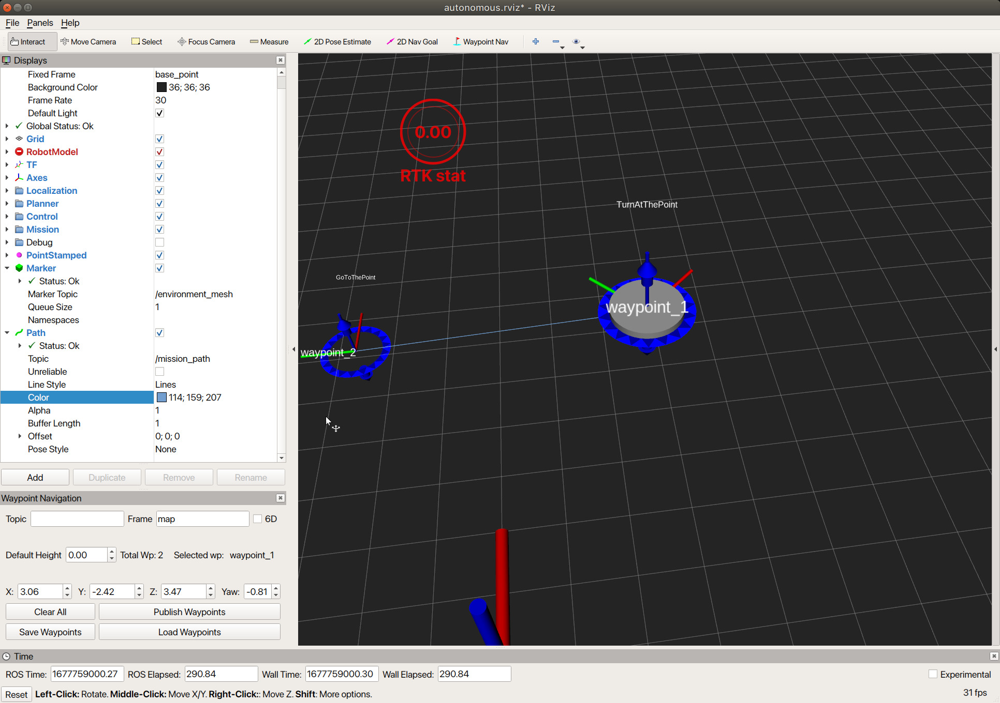
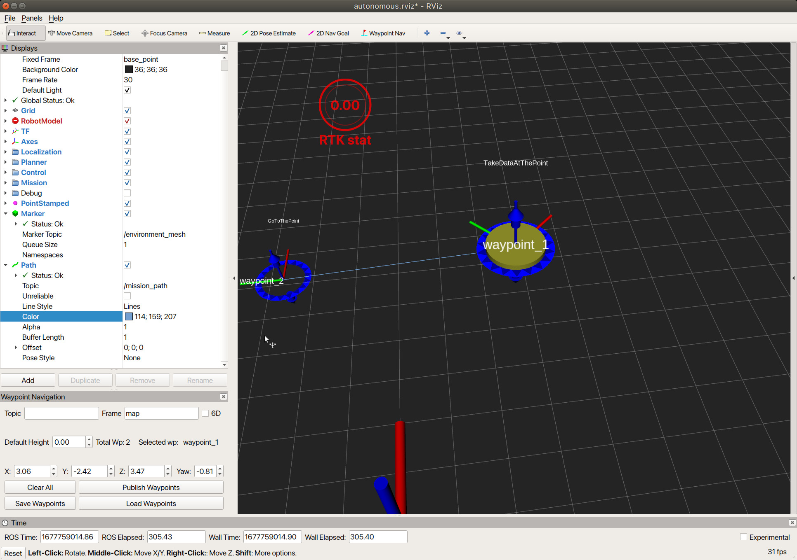

# アクションタイプ切り替え
 アクションを与えたいウェイポイントを右クリックするとウィンドウがポップアップするので、与えたいアクションの種類を選択することでアクションを変更できます。  
 デフォルトのアクションは, ある点にたどり着いたらそのまま通過する『GoToThePoint』アクションになります。　

定義されている行動タイプは以下三つとなっています。
- GoToThePoint
- TurnAtThePoint
- TakeDataAtThePoint

