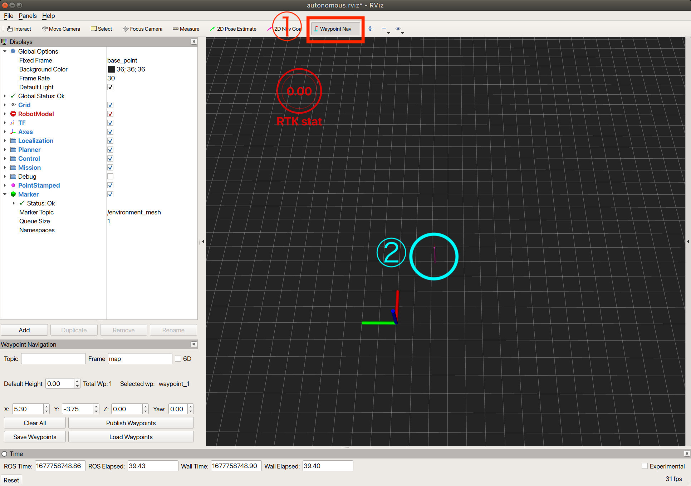
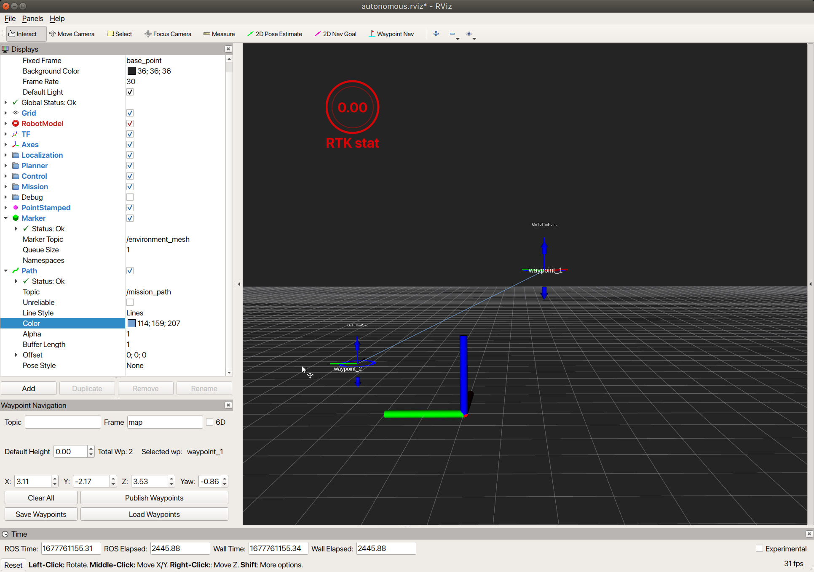
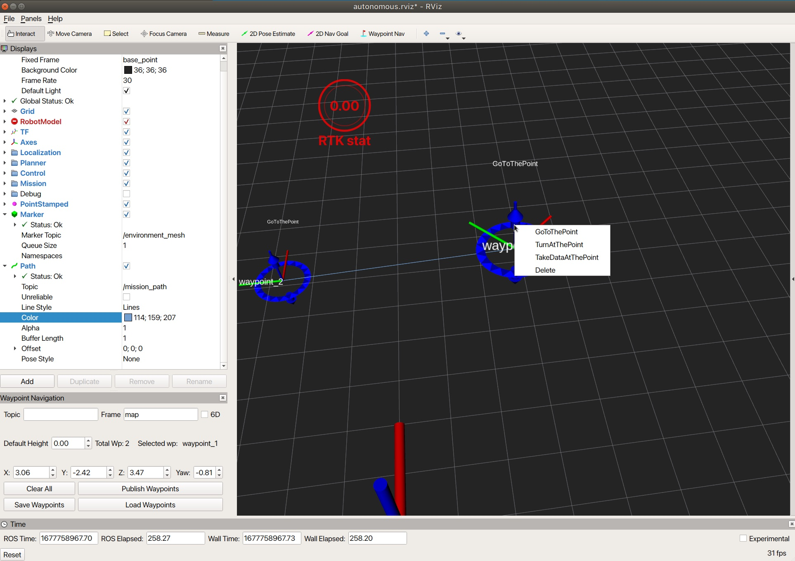

# Rviz-Mission-Create-Plugin使い方

### Rviz-Mission-Create-Plugin
以下コマンドによりRvizを立ち上げます。
```
roslaunch waypoint_navigation_plugin create_way_points.launch
```
Rvizが正常に起動すると以下のような画面が現れます。


### ウェイポイント（目標位置）の基本操作

1. ウェイポイントを配置するためには、まずRviz のツールバー上の「Waypoint Nav」ボタンを押します。
2. 「Waypoint Nav」ボタンを押したのちマウスをグリッド上に動かすと、ピンが見えるようになります。ピンが見えている状態で左クリックするとウェイポイントが画面上に配置されます。 


ウェイポイントが配置された様子　


同様の操作で複数のウェイポイントを配置することができます。


### ウェイポイント位置・向きの操作

各ウェイポイントが持つ青いリングをクリックしながらマウスを動かすことでウェイポイントの位置・向きを変更することができます。赤字軸が前方方向、緑軸が左方向です。


### ウェイポイント高さの操作

Rviz のツールバー上の「Interact」ボタンを押したのち、画面操作を行うことでカメラ視点の切り替えを行うことができます。


ウェイポイントが持つ上下に伸びた青い矢印をクリックしながらマウスを動かすことで、ウェイポイントの高さを変更することができます。



このような機能を使うことで、高さや向きが異なる複数のウェイポイントを作成することが可能となります。


### アクションタイプを切り替える
 アクションを与えたいウェイポイントを右クリックするとウィンドウがポップアップするので、与えたいアクションの種類を選択することでアクションを変更できます。  
 デフォルトのアクションは, ある点にたどり着いたらそのまま通過する『GoToThePoint』アクションになります。　




定義されている行動タイプは以下三つとなっています。
- GoToThePoint
- TurnAtThePoint
- TakeDataAtThePoint


