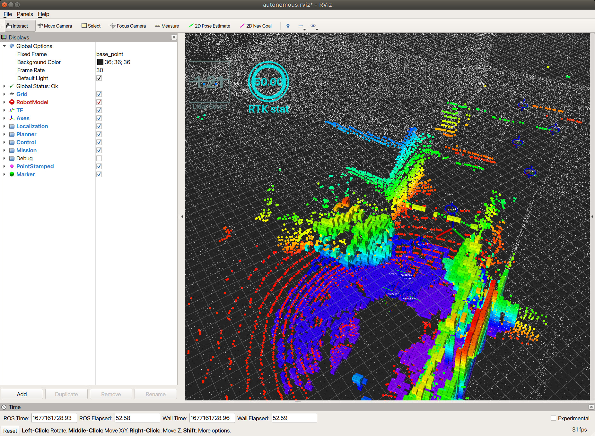

# サンプルデータを使ったテスト手順

Rviz-Mission-Create-Pluginを用いて作成したルートは、ロボットが自律移動時に使用する移動ルートとして使用することを想定しています。
以下ではドローンにルートを与えて自律移動をさせた際の実際のログデータを再生し、Rviz Configファイルを読み込んで必要項目をビジュアライズする手順を解説します。

### 手順
インストール方法に従い環境をセットアップした後、以下コマンドをそれぞれ別 terminal で実行してください。
```
roscore
```
autonomous.rvizがRviz用の設定ファイルです。読み込むことで必要項目の設定が完了した状態でRvizが起動します。
```
rviz -d autonomous.rviz
```
サンプルデータはこちらからダウンロードしてください。[link](https://drive.google.com/drive/folders/1a2z_xs5PSq_u20nYRY_GsOr9l80hRzBC?usp=share_link)
サンプルデータを再生します。
```
rosbag play record_data.bag
```

rviz上でドローンが自律飛行時に認識している周囲の情報を表示することができます。


